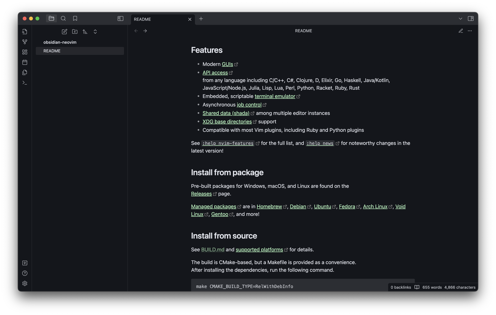
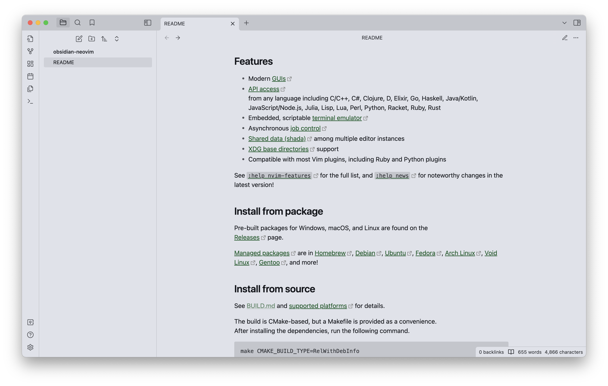

# Obsidian + Neovim

This is a basic Obsidian theme, only with modified colors to match the default Neovim color scheme, so nothing supernatural. The default Neovim color scheme is [announced](https://neovim.io/roadmap/) in version 0.10.

Check [this pull request](https://github.com/neovim/neovim/pull/26540) for more information.

## Screenshots

### Dark

### Light

## Contributing

If you have any problems or have suggestions, welcome to issues.

